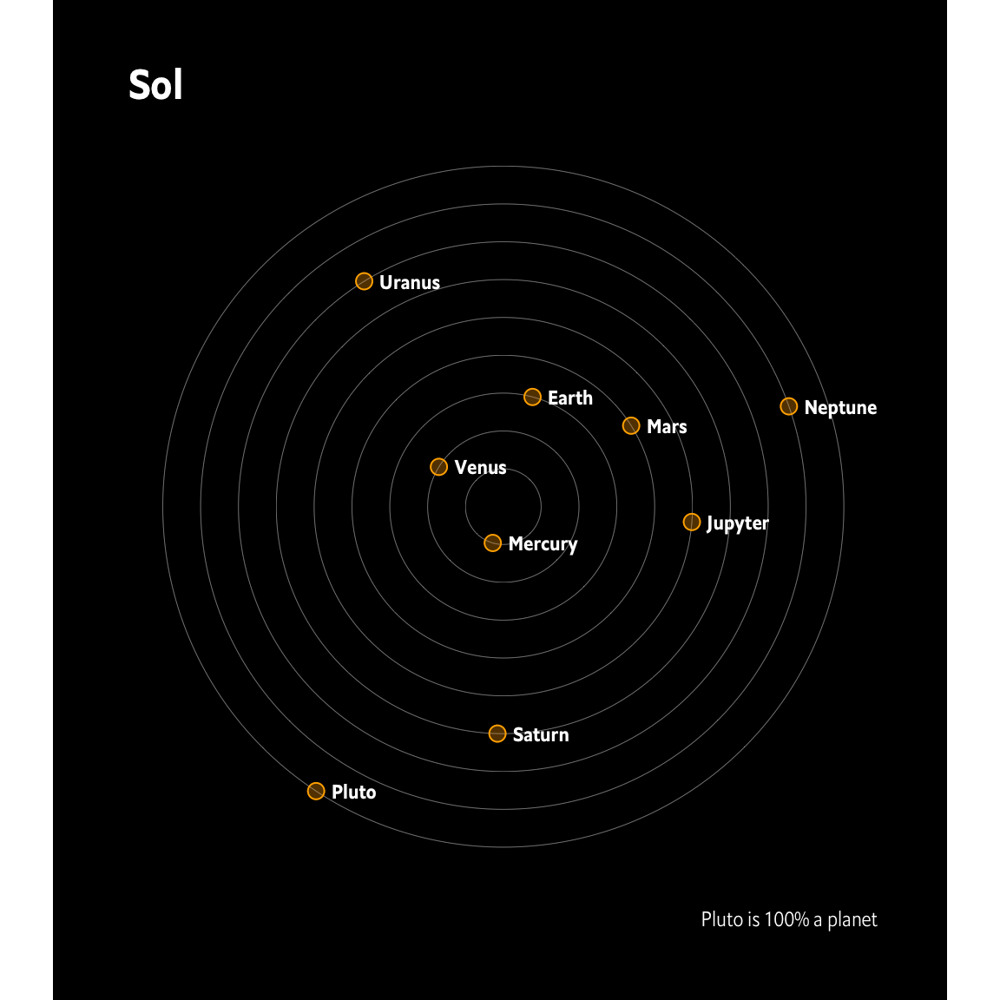
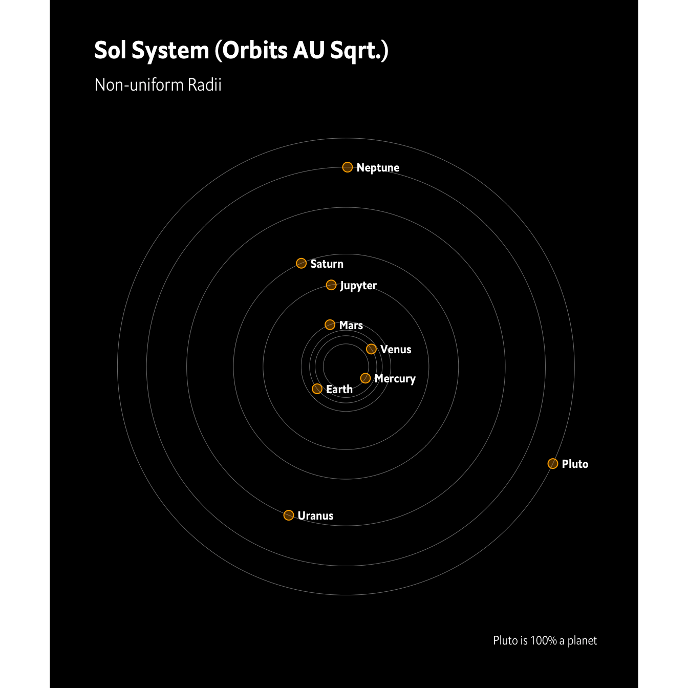
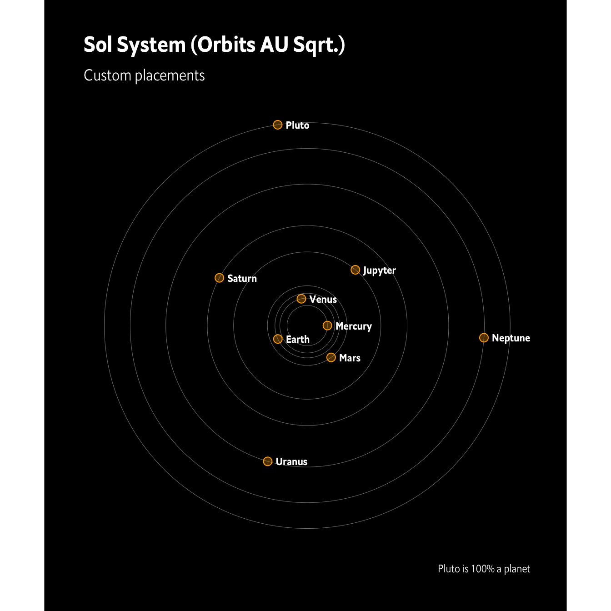

[](https://www.repostatus.org/#active)

[](https://github.com/hrbrmstr/ggsolar/actions?query=workflow%3AR-CMD-check)  


# ggsolar

Generate Solar System Plots

## Description

Generate “solar system” plots using everyone’s favorite plotting
package.

## What’s Inside The Tin

The following functions are implemented:

- `generate_orbits`: Generate concentric circular orbits for “n” planets
- `generate_random_planets`: Generate a vector of n believable planetary
  names using hidden Markov model.
- `plot_orbits`: Return a skeleton of a ggplot2 plot of solar system
  plot
- `randomize_planet_positions`: Generate random planetary positions
  given a data frame of orbits
- `scaffold_planet_plot`: Get a boilerplate to work from
- `sol_planets`: Our Solar System
- `theme_enhance_solar`: Provides basic cleanup defaults for solar
  system plots

## Installation

``` r
remotes::install_github("hrbrmstr/ggsolar")
```

NOTE: To use the ‘remotes’ install options you will need to have the
[{remotes} package](https://github.com/r-lib/remotes) installed.

## Usage

``` r
library(ggsolar)
library(ggplot2)

# current version
packageVersion("ggsolar")
## [1] '0.1.1'
```

## Sol

``` r
sol_orbits <- generate_orbits(sol_planets)

set.seed(1323) # this produced decent placements

placed_planets <- randomize_planet_positions(sol_orbits)

plot_orbits(
  orbits = sol_orbits, 
  planet_positions = placed_planets,
  label_planets = TRUE,
  label_family = hrbrthemes::font_es_bold
) +
  hrbrthemes::theme_ipsum_es(grid="") +
  coord_equal() +
  labs(
    title = "Sol",
    caption = "Pluto is 100% a planet"
  ) +
  theme_enhance_solar()
```



## Non-uniform Radii

We’ll plot Sol’s system with the square root of the actual radius AU’s
(which are `0.39`, `0.72`, `1.00`, `1.52`, `5.20`, `9.58`, `19.18`,
`30.07`, `39.48`):

``` r
sol_dist <- sqrt(c(0.39, 0.72, 1.00, 1.52, 5.20, 9.58, 19.18, 30.07, 39.48))
sol_orbits <- generate_orbits(sol_planets, radii = sol_dist, num_polygon_points = 1000)

set.seed(42)
sol_placements <- randomize_planet_positions(sol_orbits)

plot_orbits(
  orbits = sol_orbits, 
  planet_positions = sol_placements,
  label_planets = TRUE,
  label_family = hrbrthemes::font_es_bold
) +
  hrbrthemes::theme_ipsum_es(grid="") +
  coord_equal() +
  labs(
    title = "Sol System (Orbits AU Sqrt.)",
    subtitle = "Non-uniform Radii",
    caption = "Pluto is 100% a planet"
  ) +
  theme_enhance_solar()
```



## Custom Planet Placements!

We’ll plot Sol’s system with the square root of the actual radius AU’s
(which are `0.39`, `0.72`, `1.00`, `1.52`, `5.20`, `9.58`, `19.18`,
`30.07`, `39.48`):

``` r
sol_dist <- sqrt(c(0.39, 0.72, 1.00, 1.52, 5.20, 9.58, 19.18, 30.07, 39.48))
sol_orbits <- generate_orbits(sol_planets, radii = sol_dist, num_polygon_points = 1000)

my_pos <- function(n) {
  seq(from = 0, to = 1, length.out = 9)
}

sol_placements <- randomize_planet_positions(sol_orbits, randomizer = my_pos)

plot_orbits(
  orbits = sol_orbits, 
  planet_positions = sol_placements,
  label_planets = TRUE,
  label_family = hrbrthemes::font_es_bold
) +
  hrbrthemes::theme_ipsum_es(grid="") +
  coord_equal() +
  labs(
    title = "Sol System (Orbits AU Sqrt.)",
    subtitle = "Custom placements",
    caption = "Pluto is 100% a planet"
  ) +
  theme_enhance_solar()
```



## Rando!

``` r
set.seed(42)
(rando_planets <- generate_random_planets(12))
##  [1] "Ososi"       "Morlambtune" "Obli Vi"     "Lantitan"    "Tanthos"     "Onhy"        "Lesbomor C"  "Radido"     
##  [9] "Lesstel"     "Altan Prime" "Lasdre"      "Brenta"

rando_orbits <- generate_orbits(rando_planets)

set.seed(123) # this produced decent placements

placed_planets <- randomize_planet_positions(rando_orbits)

plot_orbits(
  orbits = rando_orbits, 
  planet_positions = placed_planets,
  label_planets = TRUE,
  label_family = hrbrthemes::font_es_bold
) +
  hrbrthemes::theme_ipsum_es(grid="") +
  coord_equal() +
  labs(
    title = "Rando System"
  ) +
  theme_enhance_solar()
```


## ggsolar Metrics

| Lang | \# Files |  (%) | LoC |  (%) | Blank lines |  (%) | \# Lines |  (%) |
|:-----|---------:|-----:|----:|-----:|------------:|-----:|---------:|-----:|
| R    |        8 | 0.36 | 217 | 0.32 |          47 | 0.25 |      150 | 0.39 |
| Rmd  |        1 | 0.05 |  80 | 0.12 |          38 | 0.20 |       42 | 0.11 |
| YAML |        2 | 0.09 |  38 | 0.06 |          10 | 0.05 |        2 | 0.01 |
| SUM  |       11 | 0.50 | 335 | 0.50 |          95 | 0.50 |      194 | 0.50 |

clock Package Metrics for ggsolar

## Code of Conduct

Please note that this project is released with a Contributor Code of
Conduct. By participating in this project you agree to abide by its
terms.
